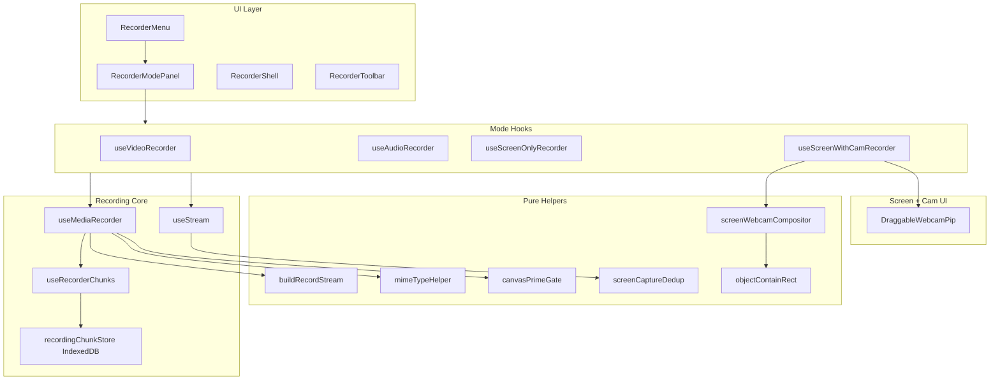

# Architecture

Capture Studio is a client-only Next.js app. All recording happens in the browser.

## Layer diagram

## Hook responsibilities

| Hook / module | Role |
|---------------|------|
| `useStream` | Acquire and attach mic, camera, screen streams |
| `useMediaRecorder` | Orchestrate recorder lifecycle; delegates to modules below |
| `useRecorderSetup` | Create `MediaRecorder`, wire `ondataavailable` / `onstop` |
| `useRecorderControls` | Start, stop, pause, resume, download; restart + screen repick |
| `useRecorderChunks` | Chunk accumulation + IDB spillover |
| `useRecordingCountdown` | Pre-roll countdown before `beginRecordingSession` |
| `useRecordingTimer` | Elapsed time and hard limit enforcement |
| `useRecordingNotifications` | Desktop nudges when countdown is enabled |
| `useScreenTrackMonitor` | Handle browser screen-share stop |
| `buildRecordStream` | Build `MediaStream` for encoder (canvas + tracks) |
| `DraggableWebcamPip` | Live preview overlay; drag + clamp placement |
| `screenWebcamCompositor` | Canvas draw math shared with recorded composite |

## Module singletons

These are intentional—see [browser-quirks.md](browser-quirks.md):

- `canvasPrimeGate` — coordinate canvas warmup across async recorder start
- `screenCaptureDedup` — dedupe concurrent `getDisplayMedia` (React Strict Mode)
- `mimeTypeHelper` cache — probe `isTypeSupported` once per page load

## Data flow

1. User picks mode → mode hook initializes streams.
2. Streams merged into `mediaStream` → `setupRecorder` creates `MediaRecorder`.
3. User starts (or countdown completes) → `beginRecordingSession` primes canvas if needed, calls `recorder.start(timeslice)`.
4. Chunks append to memory; spill to IDB over threshold.
5. Stop → `requestData`, `onstop` → finalize blob → preview via object URL.
6. Optional: **Keep recording** stores blob + metadata in `RecordingContext` for the session.

### Restart flow

- Toolbar shows one discard confirm when restarting from preview.
- `recorderStart(true)` clears prior chunks/blob.
- **Screen / screen + camera:** `reinitializeStreams({ force: true })` re-opens the share picker; countdown starts only after the new `mediaStream` is ready (`armRestartCountdownAfterStream`).
- **Camera / audio:** countdown begins immediately after discard.
